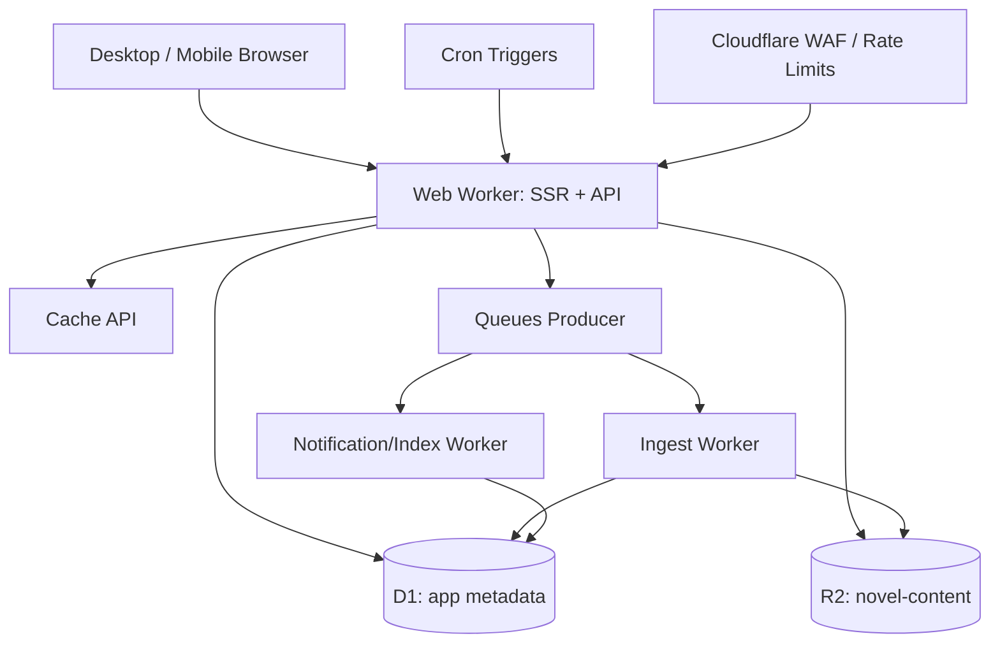

# 悦读小说平台 Cloudflare 技术架构

> 日期：2026-08-13  
> 目标：给出可直接执行的框架、组件、数据、资源与部署方案。  
> 基线：Cloudflare Workers + D1 + R2，Desktop/Mobile 共用一套全栈工程。

## 1. 最终技术选型

| 层级 | 技术 | 用途与决策 |
|---|---|---|
| 语言 | TypeScript（strict） | 前后端统一类型，减少契约漂移 |
| Web 框架 | React Router v8 Framework Mode | SSR、路由、数据加载、表单 Action、流式响应 |
| 构建与本地运行 | Vite + Cloudflare Vite Plugin | 本地使用 Workers Runtime 语义，减少 Node/Worker 差异 |
| 运行平台 | Cloudflare Workers | SSR、BFF/API、鉴权、R2 流式正文响应 |
| 样式 | Tailwind CSS v4 | Token 化响应式样式和暗色模式 |
| UI 原语 | shadcn/ui + Radix UI | Dialog、Drawer、Dropdown、Tabs、Tooltip、Form 等可访问组件 |
| 图标 | Lucide React | 统一图标，避免手绘 SVG |
| 响应式抽屉 | Vaul（通过 shadcn Drawer） | Mobile 底部抽屉与设置面板 |
| 表单 | React Hook Form + Zod | 客户端体验与服务端共享校验 Schema |
| 数据表 | TanStack Table | 作者端和后台复杂表格，Mobile 自定义卡片呈现 |
| 富文本编辑器 | Tiptap StarterKit 的受限扩展 | 章节正文语义编辑；禁用不需要的复杂节点 |
| 虚拟列表 | TanStack Virtual | 大目录、章节列表、后台长列表 |
| 拖拽 | dnd-kit | 分卷/章节排序与书架管理 |
| ORM | Drizzle ORM + drizzle-kit | D1 类型安全查询与 SQL migration |
| 数据库 | Cloudflare D1 | 用户、目录、状态、进度、审核和运营元数据 |
| 对象存储 | Cloudflare R2 | 章节正文版本、上传原文件、封面、导出和解析产物 |
| 异步任务 | Cloudflare Queues | 导入解析、索引、通知、统计聚合；消费者必须幂等 |
| 定时任务 | Workers Cron Triggers | 定时发布、榜单聚合、过期清理、对账 |
| 缓存 | Cache API + HTTP Cache-Control | 公开详情、章节正文和静态资源边缘缓存 |
| 限流 | Workers Rate Limiting binding + WAF | 登录、注册、搜索、上传、评论和后台敏感接口 |
| 鉴权 | Better Auth + Drizzle Adapter + D1 | 邮箱/用户名密码、会话、验证、2FA 扩展；先做兼容性 PoC |
| 邮件 | Resend 或项目指定邮件供应商 | 验证邮箱、重置密码、审核通知；通过 Worker fetch 调用 |
| 测试 | Vitest + @cloudflare/vitest-pool-workers | Worker 与 D1/R2 binding 集成测试 |
| 浏览器测试 | Playwright | Desktop/Mobile、键鼠触控、阅读器和核心 E2E |
| 质量 | ESLint + Prettier + TypeScript | 静态质量门禁 |
| 监控 | Workers Logs/Analytics Engine + Sentry（可选） | 错误、性能、业务事件与告警 |

### 1.1 选型说明

- React Router v8 与 Cloudflare Vite Plugin 作为主全栈方案，避免另建一套 Express/Node 服务。
- shadcn/ui 不是独立运行时框架，组件代码由项目拥有，便于按阅读产品定制。
- Tiptap 只用于作者编辑器；阅读器渲染经过净化的语义正文，不直接复用编辑 DOM。
- MVP 不使用 Zustand/Redux。路由数据由 React Router 管理，局部 UI 用 React state；只有出现明确跨路由客户端状态时再引入 Zustand。
- D1 FTS5 满足 MVP 的书名、作者、标签搜索；数据量或相关性要求提升后，再抽象 `SearchProvider` 接入外部搜索服务。

### 1.2 版本锁定策略

本文基于 2026-08-13 官方能力，框架基线为 React Router v8、Tailwind CSS v4、Wrangler v4 和 Better Auth v1.6 稳定线。开工当天必须执行一次兼容 PoC，再把所有生产依赖锁为精确版本并提交 lockfile；不得在 CI 使用无上限的 `latest` 自动升级。

升级规则：

- Patch：通过完整 CI 后可合并。
- Minor：检查 Cloudflare、React Router、Better Auth、Drizzle 的 migration/changelog。
- Major：单独建立升级任务，验证 D1 migration、Worker bundle、鉴权会话和 E2E。
- `compatibility_date` 固定到已验证日期，通过独立 PR 前移。

### 1.3 依赖清单

生产核心依赖：

```text
react, react-dom, react-router
better-auth, @better-auth/drizzle-adapter
drizzle-orm, zod
react-hook-form, @hookform/resolvers
@radix-ui/*, vaul, lucide-react
@tiptap/react, @tiptap/starter-kit
@tanstack/react-table, @tanstack/react-virtual
@dnd-kit/core, @dnd-kit/sortable
clsx, tailwind-merge, class-variance-authority
```

开发依赖：

```text
typescript, vite, @cloudflare/vite-plugin, wrangler
tailwindcss, @tailwindcss/vite
drizzle-kit
vitest, @cloudflare/vitest-pool-workers
@playwright/test
eslint, prettier
```

组件按需安装，不允许一次引入完整图标包、编辑器全扩展或未使用的 Radix package。

## 2. Cloudflare 资源拓扑



### 2.1 Worker 划分

MVP 建议 3 个 Worker，职责清晰但不过早微服务化：

1. `web-worker`：React Router SSR、公开 API、登录、读者、作者和后台 BFF。
2. `ingest-worker`：消费导入队列，解析 TXT、生成章节草稿和报告。
3. `jobs-worker`：消费索引、通知、统计任务并运行 Cron 聚合。

后期只有在 CPU、部署频率、权限或团队边界出现真实矛盾时再拆更多 Worker。

### 2.2 Binding 建议

```text
DB_APP            D1Database
R2_CONTENT        R2Bucket
QUEUE_INGEST      Queue
QUEUE_JOBS        Queue
RATE_LIMIT_AUTH   RateLimit
RATE_LIMIT_SEARCH RateLimit
ASSETS            Fetcher
```

Secrets 使用 `wrangler secret` 管理：`BETTER_AUTH_SECRET`、邮件 API Key、Sentry DSN 等。禁止写入仓库或 D1 普通配置表。

## 3. 工程目录建议

```text
app/
├─ routes/                  React Router 路由与 loader/action
│  ├─ public/               首页、分类、搜索、详情
│  ├─ reader/               阅读器
│  ├─ account/              书架、历史、设置
│  ├─ creator/              作者工作台
│  ├─ admin/                管理后台
│  └─ api/                  需要独立资源响应的 API route
├─ components/
│  ├─ ui/                   shadcn 基础组件
│  ├─ book/                 BookCard、目录、标签
│  ├─ reader/               ReaderShell、分页、设置、书签
│  ├─ creator/              编辑器、章节树、导入向导
│  └─ admin/                DataTable、审核面板
├─ features/                按业务域组织用例与前端适配层
├─ server/
│  ├─ auth/
│  ├─ db/
│  ├─ repositories/
│  ├─ services/
│  ├─ storage/
│  ├─ queues/
│  └─ security/
├─ schemas/                 Zod 请求、表单和消息 Schema
├─ styles/                  Token、阅读主题、全局样式
└─ types/

workers/
├─ ingest/                  TXT 解析消费者
└─ jobs/                    索引、通知、统计消费者与 Cron

drizzle/
├─ schema/
├─ migrations/
└─ seeds/

tests/
├─ unit/
├─ integration/
└─ e2e/
```

禁止把 SQL、R2 Key 拼接、权限判断散落在 React 组件中；组件调用 feature/service，service 访问 repository/storage。

### 3.1 路由表

| 路由 | 页面 | 访问 |
|---|---|---|
| `/` | 首页 | 公开 |
| `/categories`、`/categories/:slug` | 分类聚合/结果 | 公开 |
| `/rankings/:type` | 榜单 | 公开 |
| `/search` | 搜索结果 | 公开 |
| `/books/:bookId-:slug` | 作品详情 | 公开 |
| `/read/:bookId/:chapterId` | 阅读器 | 公开章节公开，私有资产需登录 |
| `/authors/:authorId` | 作者主页 | 公开 |
| `/library` | 我的书架 | 登录 |
| `/history`、`/annotations` | 历史、书签笔记 | 登录 |
| `/settings/*` | 资料、阅读、通知、安全 | 登录 |
| `/creator` | 作者概览 | 作者 |
| `/creator/books/*` | 作品、章节、导入、编辑 | 作者 |
| `/admin` | 后台概览 | 管理权限 |
| `/admin/users/*` | 用户和角色 | 用户管理权限 |
| `/admin/moderation/*` | 审核与举报 | 审核权限 |
| `/admin/operations/*` | 分类、推荐、公告 | 运营权限 |
| `/admin/system/*` | 配置、任务、日志 | 系统权限 |

### 3.2 组件责任表

| 组件 | 责任 | 禁止承担 |
|---|---|---|
| `AppHeader` / `MobileNav` | 全局导航、角色入口 | 查询业务列表 |
| `BookCard` / `BookListItem` | 作品摘要与统一状态 | 自行拼接详情 API |
| `FilterPanel` | 筛选表单与 URL 参数 | 保存全局隐式状态 |
| `ReaderShell` | 阅读布局、面板、快捷键 | 直接写 D1/R2 |
| `ReaderContent` | 段落渲染、锚点观测 | 审核或编辑逻辑 |
| `ReaderSettingsDrawer` | 主题排版即时预览 | 定义服务端默认值 |
| `ChapterTree` | 分卷章节导航与排序 UI | 直接提交发布状态 |
| `ChapterEditor` | Tiptap、字数、保存状态 | 绕过 service 上传正文 |
| `ImportWizard` | 导入步骤与候选修正 | 在浏览器完成可信解析 |
| `DataTable` | 后台排序筛选选择 | 决定权限和危险操作 |
| `ReviewWorkspace` | 审核上下文、差异、意见 | 修改作者原文 |

## 4. D1 数据设计

### 4.1 建库策略

MVP 使用一个 `ibook-app-{env}` D1 数据库。D1 单库容量和写入模型要求避免无限堆积正文与日志。

扩容触发条件：

- 数据库接近容量或查询/写入热点明显。
- 管理审计、分析事件影响核心阅读事务。
- 多租户或区域合规要求出现。

扩容后建议拆为：

- `identity-db`：用户、会话、角色。
- `catalog-db`：作品、章节元数据、搜索索引。
- `reader-db-{shard}`：按 userId 哈希分片的用户资产。
- 审计与高体量分析数据迁移至 Analytics Engine、R2 或专用系统。

D1 不支持跨库事务，因此拆库前必须将业务一致性改为事件和幂等补偿。

### 4.2 核心表

身份：

```text
users, user_profiles, auth_accounts, auth_sessions,
roles, permissions, role_permissions, user_roles, login_events
```

目录与内容：

```text
authors, books, book_contributors, categories, tags, book_tags,
volumes, chapters, chapter_versions, publications
```

读者资产：

```text
shelves, shelf_items, reading_progress, reading_preferences,
reading_history, bookmarks, highlights, notes
```

创作与治理：

```text
import_jobs, import_chapter_candidates, review_tasks, review_actions,
reports, report_actions, notifications
```

运营与系统：

```text
recommendation_slots, recommendation_items, ranking_snapshots,
announcements, feature_flags, site_settings, audit_logs, job_dedup
```

### 4.3 关键字段与约束

- 主键使用 UUIDv7/ULID 文本或经过验证的整数策略；全项目统一。
- 时间统一存 UTC ISO 或整数 epoch，展示层转时区。
- `books.slug`、规范化书名、作者笔名建立必要唯一/普通索引。
- `chapters` 存标题、序号、状态和当前发布版本 ID，不存大正文。
- `chapter_versions` 存 R2 Object Key、内容哈希、字数、版本、创建者。
- `reading_progress` 对 `(user_id, book_id)` 唯一，并带 `version` 做乐观并发。
- `review_actions` 与 `audit_logs` 追加写，不覆盖历史。
- 所有软删除记录 `deleted_at`、`deleted_by` 和原因。

### 4.4 全文搜索

MVP 使用 D1 SQLite FTS5：

- `books_fts`：书名、书名拼音/归一化文本、简介、作者名。
- 标签与分类通过关联表过滤，不把所有筛选塞进 FTS 字符串。
- 发布/更新/下架生成 `SEARCH_REINDEX_BOOK` 队列消息。
- 索引消费者使用事件 ID 幂等；删除或下架同步移除公开索引。
- 搜索服务通过 `SearchProvider` 接口封装，便于未来迁移。

## 5. R2 对象设计

建议 Bucket：

- `ibook-content-{env}`：章节正文、导入原文件和解析结果。
- `ibook-media-{env}`：封面、头像等公开/半公开媒体；小规模可先合桶用前缀隔离。

### 5.1 Object Key

```text
books/{bookId}/chapters/{chapterId}/versions/{versionId}.json.gz
books/{bookId}/imports/{importJobId}/source.txt
books/{bookId}/imports/{importJobId}/report.json
books/{bookId}/exports/{exportId}.txt
covers/{bookId}/{assetHash}/original.webp
covers/{bookId}/{assetHash}/w320.webp
covers/{bookId}/{assetHash}/w640.webp
avatars/{userId}/{assetHash}.webp
```

Key 只包含不可变 ID 和安全后缀，不使用用户原始文件名，不允许路径穿越。

### 5.2 正文格式

章节发布版本建议存规范化 JSON：

```text
version, bookId, chapterId, title, paragraphs[], contentHash, wordCount
```

每个段落有稳定 `paragraphId`，用于书签、笔记和阅读进度。对象使用内容哈希和 immutable Cache-Control；章节元数据指向当前版本 Key。

### 5.3 上传与访问

- 小文件可经 Worker 鉴权后流式写入 R2。
- 大文件或后期更高上传量使用短时有效的签名 URL/受控上传流程。
- 生产公开媒体使用自定义域名；私密原文件和草稿只能经鉴权 Worker 访问。
- 下载响应流式传递，不用 `arrayBuffer()` 缓冲整章或整本。
- 设置 CORS、Content-Type、Content-Disposition 和 CSP，阻止上传内容变成可执行脚本。

## 6. Queues 与后台任务

Queues 为 at-least-once 投递，所有消费者必须幂等。

### 6.1 消息类型

```text
IMPORT_PARSE
IMPORT_COMMIT
SEARCH_REINDEX_BOOK
NOTIFY_REVIEW_RESULT
NOTIFY_BOOK_UPDATED
PUBLISH_SCHEDULED_CHAPTER
AGGREGATE_RANKING
CLEANUP_ORPHAN_OBJECTS
```

统一消息外壳：

```text
eventId, eventType, schemaVersion, aggregateId,
occurredAt, actorId, payload, traceId
```

### 6.2 幂等和失败

- 消费前插入/检查 `job_dedup(event_id, handler)`。
- D1 状态更新使用条件更新，例如仅允许 `pending_review → approved`。
- 通知使用唯一业务键，避免重复发送。
- 超过重试次数进入 dead-letter queue，后台显示重跑和放弃操作。
- 任务日志只记录对象 ID、阶段和错误摘要，不记录完整正文。

### 6.3 TXT 导入流水线

1. Web Worker 校验文件元数据并创建 `import_jobs`。
2. 原文件流式写入 R2，发送 `IMPORT_PARSE`。
3. Ingest Worker 读取编码采样，识别 UTF-8/GB18030 等。
4. 分块解码和章节标题识别，生成候选章节及警告。
5. 候选摘要写 D1，详细报告写 R2，状态变为 `awaiting_confirmation`。
6. 作者在 UI 合并、拆分、重命名并确认。
7. `IMPORT_COMMIT` 生成章节草稿与 R2 正文对象。

解析算法必须设置 CPU/文件大小/章节数上限，超限时可读失败，不让 Worker 失控。

## 7. 鉴权与权限实现

### 7.1 Better Auth 决策

- 使用 Better Auth 的 D1/Drizzle 适配能力管理账号、会话和验证流程。
- 在正式开发前完成一个 PoC：注册、登录、登出、会话刷新、D1 migration、Worker 部署。
- 如果当前版本适配阻塞，保留同一 auth service 接口，退回轻量自建 credentials/session；不得临时换成 Node-only 库。

### 7.2 会话

- Cookie：`HttpOnly`、`Secure`、合理 `SameSite`、明确过期时间。
- 高权限操作要求近期重新认证或二次验证。
- 管理后台按角色和细粒度 permission 双重检查。
- loader/action/API 统一调用 `requireUser`、`requireRole`、`requirePermission`。
- 前端隐藏按钮只改善体验，不能代替服务端鉴权。

## 8. 缓存策略

| 数据 | 策略 |
|---|---|
| 静态资产 | 长缓存 + 内容哈希 |
| 首页和榜单 | 短 TTL + stale-while-revalidate |
| 公开作品详情 | 短/中 TTL，发布事件主动换版本或清理 |
| 已发布章节版本 | immutable，URL/Key 含版本 ID |
| 当前章节指针 | 短 TTL，避免发布后长时间旧内容 |
| 私有书架/进度/草稿 | `private, no-store`，不进共享 Cache |
| 搜索结果 | 可按规范化 query 短缓存，排除个性化条件 |

缓存 Key 必须包含语言、主题无关的内容维度和权限边界；不能把已登录私有响应缓存成公开对象。

## 9. API 与路由契约

React Router loader/action 优先处理页面数据；以下资源使用独立 API route：

```text
/api/auth/*
/api/search/suggest
/api/books/:bookId/chapters/:chapterId/content
/api/reader/progress
/api/reader/preferences
/api/library/shelf
/api/creator/import-jobs
/api/creator/import-jobs/:id/confirm
/api/moderation/tasks/:id/decision
/api/uploads/*
```

规则：

- Zod 在服务端校验所有输入；客户端共享同源 Schema 只用于提前提示。
- 错误响应包含稳定 `code`、用户可读 `message`、`traceId`。
- 写接口支持 `Idempotency-Key` 或实体 `version`。
- 列表统一 cursor 或 page 规范，排序字段白名单化。
- 正文响应支持 ETag、Range/流式策略按实测选择。

## 10. 阅读器技术设计

### 10.1 模块

```text
ReaderShell           布局与工具栏
ReaderContent         语义段落渲染
PaginationEngine      逻辑分页与重排
NavigationController  键鼠触控映射
ReaderSettings        主题和排版
ProgressTracker       锚点采集、本地保存、云同步
AnnotationLayer       书签/P1 划线笔记
```

### 10.2 分页策略

- 滚动模式直接渲染段落并使用 IntersectionObserver 计算当前锚点。
- 覆盖/仿真模式先根据容器尺寸和排版 Token 计算逻辑页。
- ResizeObserver、字体加载、方向变化和设置变化触发防抖重排。
- 重排前保存当前段落锚点，重排后恢复锚点而不是恢复旧页码。
- 超长章节只在附近页/段落窗口渲染，减少 DOM 和内存。
- 仿真动画只操作合成层，不在每帧触发正文重新布局。

### 10.3 本地持久化

- `localStorage`：轻量阅读偏好和匿名进度摘要。
- IndexedDB：离线章节缓存、待同步进度、书签/笔记操作队列。
- 服务端成功确认后清理已同步 mutation。
- Schema 带版本，升级时迁移或安全回退。

## 11. UI 实现规则

- Desktop 公共页最大内容宽 1280px；阅读正文最大宽 860px。
- Mobile 底部导航和阅读器工具栏适配安全区域。
- shadcn/Radix 用于行为和可访问性，视觉 Token 必须按小说平台定制。
- 主题使用 CSS variables：平台 Light/Dark 与阅读器主题分开作用域。
- 不使用 CSS viewport 字号缩放，正文大小由用户设置控制。
- 所有图标按钮使用 Lucide 并提供 Tooltip/aria-label。
- 表格在 Mobile 转信息卡或保留清晰横向滚动，不挤成不可读列。
- 不做卡片套卡片，不用无意义渐变、装饰球和大面积营销 Hero。

## 12. 测试方案

### 12.1 Unit

- RBAC 判定、状态机、阅读锚点、分页计算、TXT 标题识别、消息幂等。
- Zod Schema、R2 Key 生成与净化、缓存 Key。

### 12.2 Worker Integration

- 使用 `@cloudflare/vitest-pool-workers` 注入 D1/R2/Queue binding。
- 真实 migration 后测试 repository、auth、上传、正文、队列消费者。
- 验证重复队列、并发审核、进度版本冲突和权限越界。

### 12.3 E2E

- Playwright Desktop：1440×900、1366×768。
- Playwright Mobile：iPhone 13/SE、Pixel 7 类视口。
- 核心链路：搜索到阅读、继续阅读、TXT 导入到审核、审核退回再提交。
- 检查软键盘/抽屉/安全区、横竖屏、主题切换、长文本溢出。
- 阅读器做截图和像素非空检查，验证正文未被工具栏遮挡。

### 12.4 性能与安全

- 使用真实超长章节和大目录测试 CPU、内存、D1 查询和 R2 流式响应。
- 对登录、搜索、上传、评论和后台接口做速率限制测试。
- 检查 XSS、CSRF、IDOR、恶意 MIME、路径 Key、缓存私有数据泄漏。

## 13. 环境与部署

### 13.1 环境

```text
local       wrangler 本地 D1/R2/Queues
preview     每个 PR 的临时 Worker/静态预览，使用隔离资源或安全测试库
staging     接近生产的持久环境
production  生产 Worker、D1、R2、Queues 与自定义域名
```

### 13.2 CI/CD

1. 安装锁定依赖。
2. lint、format check、typecheck。
3. unit 与 Worker integration tests。
4. 构建 Worker。
5. Preview 部署并运行 Playwright smoke。
6. 合并后应用生产 D1 migration，部署 Staging。
7. 人工/自动门禁通过后渐进部署 Production。
8. 监控错误率、延迟和业务指标，异常时回滚 Worker 版本。

D1 migration 必须向前兼容至少一个应用版本；破坏性字段删除分两次发布完成。

## 14. Cloudflare 约束与风险

- Workers 内存有限：所有正文、导入和导出均采用流式/分块方式。
- D1 单库容量有限且查询按单库串行：正文、媒体、长日志不进 D1；建立索引并避免 N+1。
- Queues 至少一次投递：所有消费者必须幂等，业务状态迁移使用条件更新。
- R2 公开生产流量使用自定义域名；草稿和原文件不公开。
- D1 FTS5 适合 MVP，不承诺无限规模和高级中文相关性；保持 SearchProvider 抽象。
- Better Auth 与目标版本需先 PoC，升级锁版本并阅读 migration 变更。
- Cloudflare 配额随套餐和时间变化，上线前根据正式账号再次核对容量和成本。

## 15. 技术完成定义

- Cloudflare Preview/Staging/Production 均可部署并有独立资源。
- D1 migration 可从空库完整执行，也能对上一版本安全升级。
- R2 私有对象无未授权访问，公开对象缓存正确。
- Queue 重复投递测试通过，无重复发布和重复通知。
- 阅读器在目标视口、主题、字体和方向下恢复同一段落锚点。
- 核心流程有 Playwright 证据，Worker 限制和异常路径有监控。

## 16. 官方技术依据

- [Cloudflare React Router 指南](https://developers.cloudflare.com/workers/framework-guides/web-apps/react-router/)：确认 React Router v8、SSR、Worker entry 与 Cloudflare Vite Plugin 组合。
- [Cloudflare Vite Plugin](https://developers.cloudflare.com/workers/vite-plugin/)：本地开发与 Workers Runtime/bindings 集成。
- [Cloudflare D1 Limits](https://developers.cloudflare.com/d1/platform/limits/)：容量、查询和平台限制，上线前需按套餐复核。
- [Cloudflare R2 Limits](https://developers.cloudflare.com/r2/platform/limits/)：对象大小、请求和 Bucket 限制。
- [Cloudflare Queues Delivery Guarantees](https://developers.cloudflare.com/queues/reference/delivery-guarantees/)：至少一次投递与幂等要求。
- [Better Auth Drizzle Adapter](https://better-auth.com/docs/adapters/drizzle)：Drizzle/SQLite 适配、Schema 生成与迁移说明。
- [Better Auth 1.5 Cloudflare D1 Support](https://better-auth.com/blog/1-5)：D1 一等支持与 Worker 使用方式。
